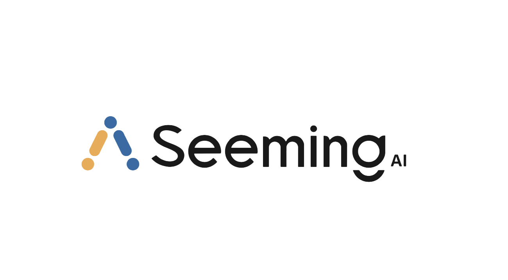
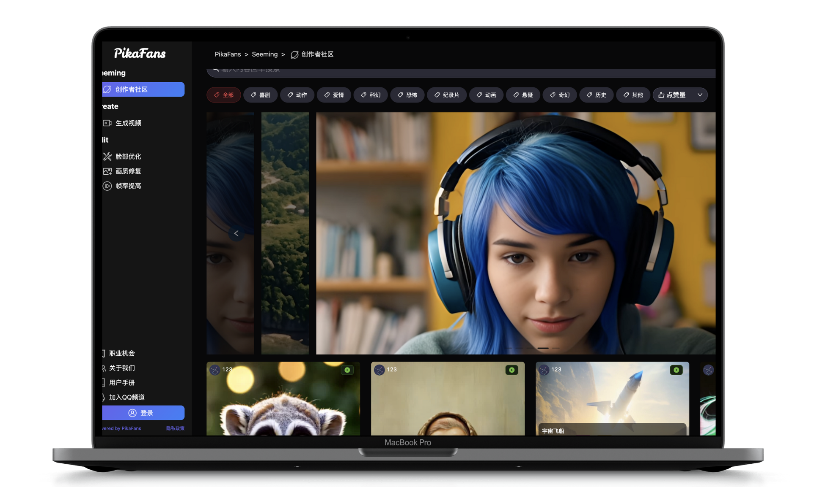
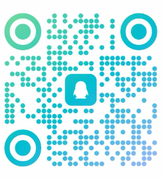

  
<h1 align="center">AI VIDEO-WEB</h1>

更新时间：2024-4-28

**简体中文** | [English](#english)

  <table>
    <tbody>
      <tr>
        <td>
         <a href="#项目简介">📝项目简介</a> 
        </td>
        <td> 
         <a href="#配置操作">😍配置操作</a> 
        </td>
        <td> 
         <a href="#合作交流">👨‍👩‍👧‍👦合作交流</a>
        </td>
        <td>
         <a href="http://www.seeming.tech/" target="_blank">🌏官方网站</a>
        </td>        
        <td>
         <a href="#交流">💬联系我们</a>
        </td>
      </tr>
    </tbody>
  </table>

🧡💛💚💙💜🤎🖤🧡💛💚💙💜🤎🖤🧡💛💚💙💜🤎🧡💛💚💙💜🤎🖤🧡💛💚💙💜🤎🖤🧡💛💚

# 项目简介
本项目为AIGC网站 web UI解决方案框架，支持您使用自己的模型来构建生成式模型的AI网站 

另外本项目另附一键部署版本[Windows](https://pan.quark.cn/s/d416f02c7aef)请下载一下文件到同一个文件夹

# 配置操作

本项目采取生成服务端与客户端的方式与后端通信，由后端向前端发送

## 服务端修改
对于服务端的ip地址请修改./web_fuction/server_fuction/Generate_server.py文件可以将127.0.01修改为你所想要发送的地址，对于路径与端口号的修改,请修改./config/web_config.ini文件
## 客户端修改
对于客户端的所要发送到的ip地址，路径与端口号请修改./web_fuction/client_fuction/send_request.py文件中修改.
## 使用您的模型
本项目可将各类图像或视频生成模型嵌入到本框架中,请封装您的模型并将输入数据改为后端所发送的响应数据与请求数据，输出为修改好的请求数据.
其模型的加载请在./web_fuction/client_fuction/moudel_selection_startup中修改,将您封装好的模型，载入runmodel方法中.
对于请求数据与后端所发送的请求数据其格式请参考./doc_personal_ai.md文档，若您需要修改它请确保后端数据与./database/database_init.py文件与./database/database.SQLite.py的一致性。

### 响应数据
对于本项目所发送的响应数据的制作请在./web_fuction/server_fuction/request_detection.py中修改.
### 请求数据
对于本项目所发送的请求数据的制作请在./web_fuction/client_fuction/request_detection.py文件中修改.

## 合作交流

> 加入AI交流社区获取更多内容

## [加入交流社区](https://qm.qq.com/q/f8bTW53g8S)
### QQ

### 微信

## 官方网站
### [Seeming AI](http://www.seeming.tech/) （[http://www.seeming.tech/](http://www.seeming.tech/)）
## 联系我们
seemingai@gmail.com