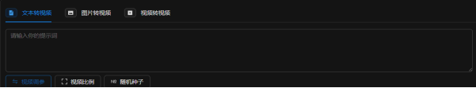
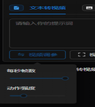
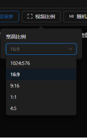
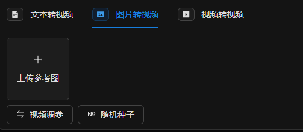
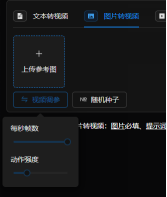
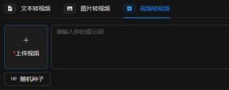
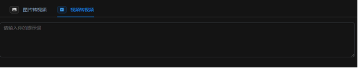
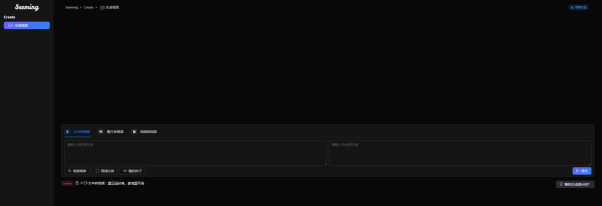
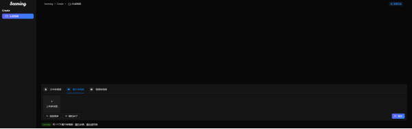
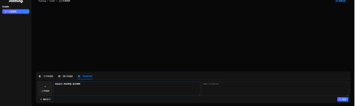

  
<h1 align="center">Seeming AI  Web</h1>

更新时间：2024-4-9

**简体中文** | [English](#english)

  <table>
    <tbody>
      <tr>
        <td>
         <a href="#一键部署">📝一键部署</a> 
        </td>
        <td> 
         <a href="#项目优势">😍项目优势</a> 
        </td>
        <td> 
         <a href="#合作交流">👨‍👩‍👧‍👦合作交流</a>
        </td>
        <td>
         <a href="https://nanjiren.online" target="_blank">🌏官方网站</a>
        </td>        
        <td>
         <a href="#交流">💬联系我们</a>
        </td>
      </tr>
    </tbody>
  </table>

🧡💛💚💙💜🤎🖤🧡💛💚💙💜🤎🖤🧡💛💚💙💜🤎🧡💛💚💙💜🤎🖤🧡💛💚💙💜🤎🖤🧡💛💚

# 项目需求

需要Nvidia GPU内存>24G

# 一键部署
## windows用户
如果您是windows用户，可以直接在Nvidia GPU上运行，只需直接下载解压文件，运行我们的Starter_Winodows.sh文件，之后便可以访问\[localhost](http:/127.0.0.1:8087)[http:/127.0.0.1:8087](http:/127.0.0.1:8087)进行AI创作
### [夸克网盘下载](https://pan.quark.cn/s/0722718996ae)
### [GooleDrive](https://drive.google.com/file/d/1Vu-Ya9JnAwe4TLXTEartLhIbC-ZTkjFr/view?usp=drive_link)
## Ubuntu用户
如果您是Ubuntu用户,请在网盘上下载我们的代码与模型，以及打包好的conda环境，只需要在conda中解压我们的环境，之后启动Starter_Linux.bat，值周便可以访问之后便可以访问[localhost](http:/127.0.0.1:8087)(http:/127.0.0.1:8087)进行AI创作
### [夸克网盘下载](https://pan.quark.cn/s/ed572994adc6)
### [GooleDrive](https://drive.google.com/file/d/1ovuTB1pvsc_t7dEw_u9GMiD_uD0QnomK/view?usp=drive_link)
## 项目优势

### 1、无需变成基础，轻松上手搭建

快速：项目提供一键部署脚本，采购服务器后只需执行一键部署脚本即可搭建，整个过程最快不超过3分钟。

简单：部署后，无需修改任何代码，无需修改任何代码，无需构建部署环节，无需额外训练，直接开始创作。

### 2、高度自由化

1.可以自由添加所选图片和相关内容

2.视频参数自由调整：每秒帧速，动作强度

3.自由种子定义，随机or固定输出自由化

3.视频尺寸比例客制化定制

#### 2.1、文本转视频

1.定制化提示词输入（强制性）：用户在使用此工具时必须输入一系列提示词。这些提示词将作为基础指导，直接影响视频内容的生成。这种方法确保了用户对最终产品有较高的控制度，使其能够更准确地反映用户的创意和目的。

2.视频参数的定制化调整：用户可以根据自己的需求来调整视频的关键技术参数，包括每秒播放的帧数和动作的强度。调整帧率可以改变视频的流畅度和观感，而动作强度的调节则可以影响视频中动画或实际动作的表现力和速度。这些调整提供了对视频风格和质感的精细控制。

3.自定义视频比例：这项功能允许用户根据需要设置视频的宽高比。这在不同的播放平台或创作风格中非常重要。用户可以选择常见的视频比例如16:9、4:3，或者更具创意的自定义比例，以符合其特定的展示或艺术需求。

#### 2.2、图片转视频
1.上传个性化参考图像：用户能够上传自己选择的图片，作为生成新图像或视频的灵感来源。这使得创作过程更加个性化，同时确保结果符合用户的特定视觉偏好或风格需求。

2.调节帧率：用户可以根据需要调整视频的帧率，这直接影响到视频播放的流畅性和视觉感受。不同的帧率设置可以用于适应不同的展示需求和创意效果。

3.调整动作强度：这允许用户修改视频内动作或动画的活力和速度，从而达到所需的视觉和情感效果，例如创造更加生动或更加柔和的场景。

#### 2.3、视频转视频

1.视频上传：这一步骤允许用户上传他们选择的视频文件。该文件可以包含各种元素，如特定的视觉场景、人物、动作或其他任何内容。上传的视频将作为转换过程的基础，确保新生成的视频内容基于用户提供的原始素材。

2.提示词输入：用户在这一环节中需要提供一组关键的提示词。这些词将作为视频转换过程中的主导指南，决定了转换后视频的主要风格和特征。提示词可以涵盖风格、色彩、情感氛围、主题等方面，它们帮助算法理解用户的具体意图，并将这些意图融入到视频转换的过程中

## 预览

### 1、文本转转视频

### 2、图片转视频

### 3、视频转视频

## 合作交流

> 加入AI交流社区获取更多内容

## [加入交流社区](https://qm.qq.com/q/f8bTW53g8S)
### QQ

### 微信

## 官方网站
### [Seeming AI](http://www.seeming.tech/) （[http://www.seeming.tech/](http://www.seeming.tech/)）
## 联系我们
seemingai@gmail.com